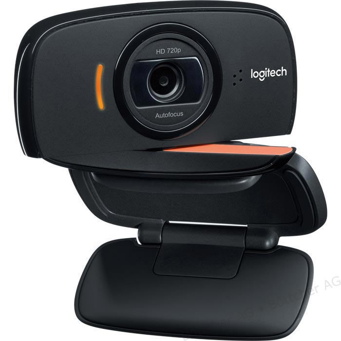
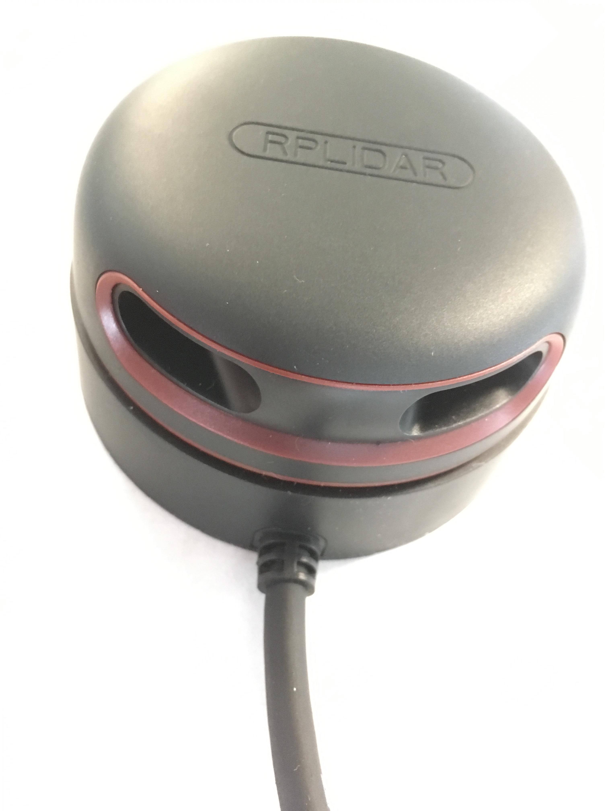
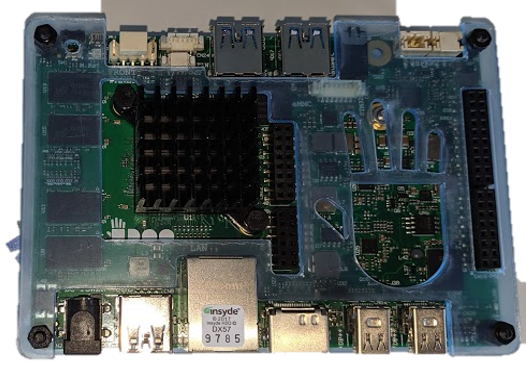
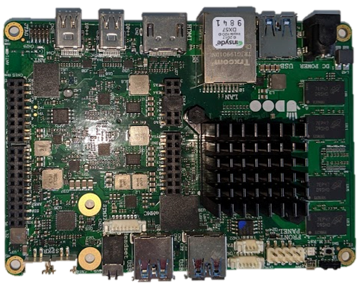
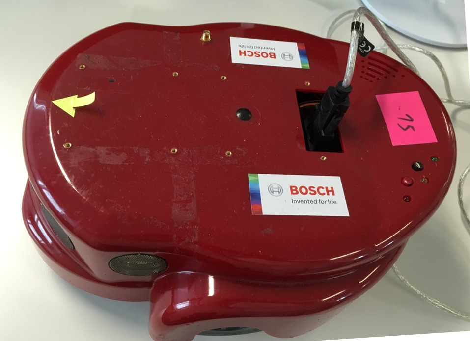
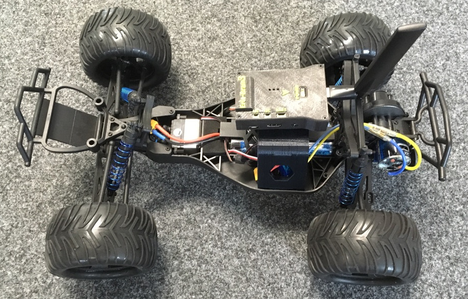
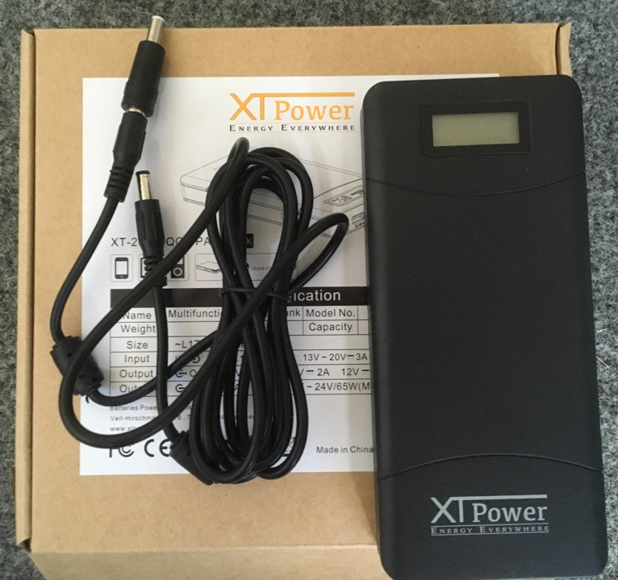

# Hardware Catalogue

<!-- TOC depthFrom:2 -->

- [Sensors](#sensors)
    - [Camera: Edimax IC-3115W](#camera-edimax-ic-3115w)
    - [Camera: Logitech B525 HD](#camera-logitech-b525-hd)
    - [Laser Scanner: RPLIDAR A2M8-R3](#laser-scanner-rplidar-a2m8-r3)
    - [Sonar](#sonar)
    - [GPS](#gps)
- [Computing](#computing)
    - [Udoo x86 ADVANCED PLUS](#udoo-x86-advanced-plus)
- [Amigobot](#amigobot)
- [Rover](#rover)
- [Power Bank XT Power](#power-bank-xt-power)
- 

<!-- /TOC -->

## Sensors

### Camera: Edimax IC-3115W

### Camera: Logitech B525 HD

### Laser Scanner: RPLIDAR A2M8-R3

### Sonar

The Amigobots are equipped with Sonar Scanners.

### GPS

The Rovers are equipped with GPS modules.

## Computing

### Udoo x86 ADVANCED PLUS

with case

without case

# Robot

## Amigobot

## Rover

# Others

## Power Bank XT Power

## Networking: TP-LINK TL-WR841ND

