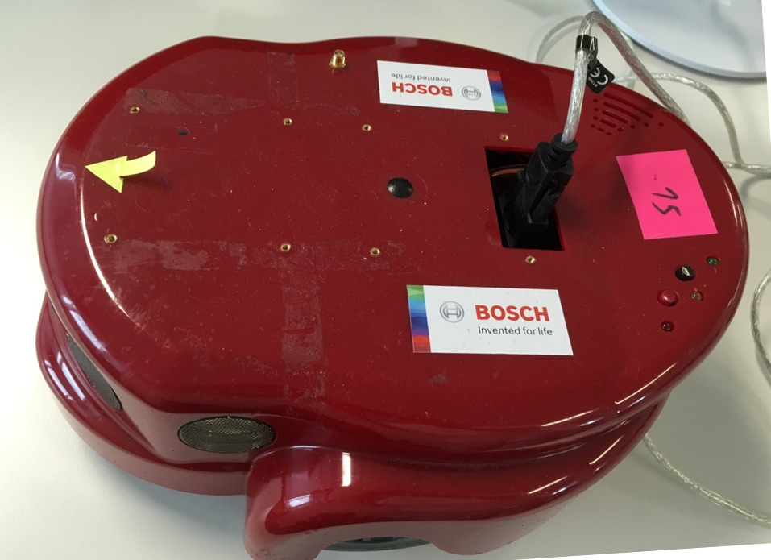
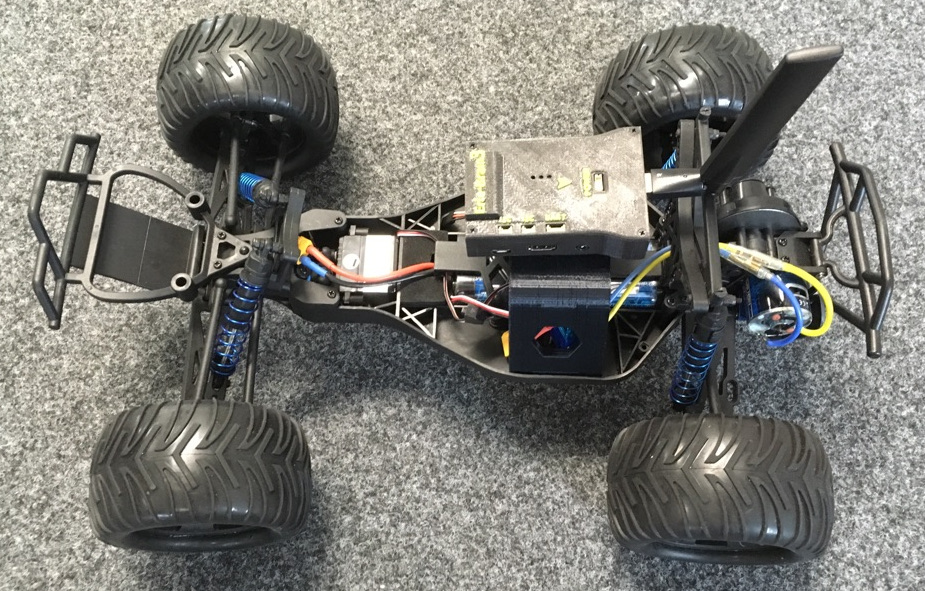
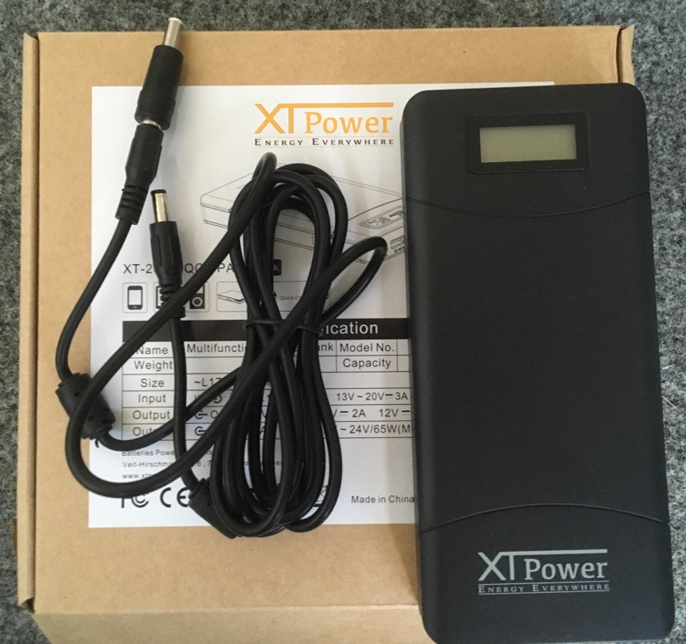

# Hardware Catalogue

# Sensors

## Camera

### Edimax IC-3115W

### Logitech B525 HD

## Laser Scanner

### RPLIDAR A2M8-R3

## Sonar

The Amigobots are equipped with Sonar Scanners.

## GPS

The Rovers are equipped with GPS modules.

# Computing

## Udoo x86 ADVANCED PLUS

<a href="computing_udoo-x86-advanced-plus.md">IMAGE MISSING</a>

## Raspberry Pi 3

TODO

# Robot

## Amigobot

## Rover

# Power

## Power Bank XT Power

