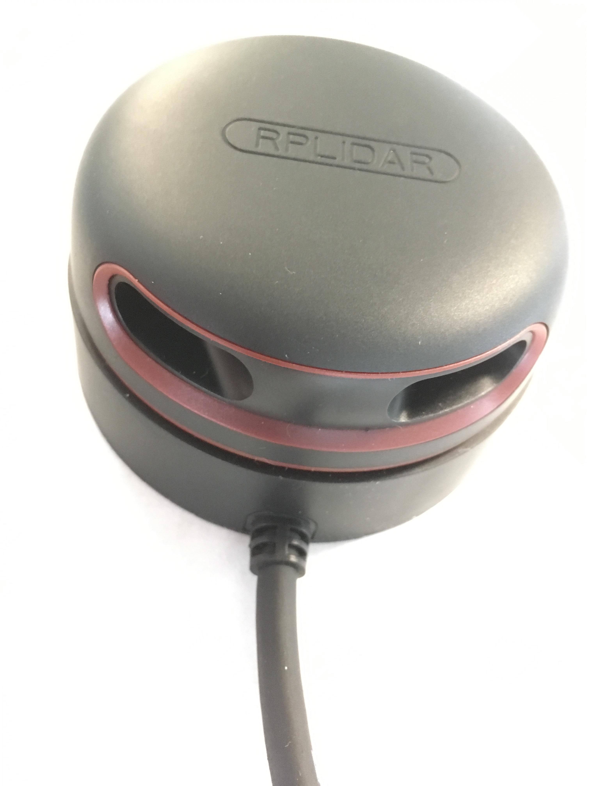

# Laserscanner RPLIDAR A2M8

# use with ros

    rosdep install rplidar_ros
    rosrun rplidar_ros rplidarNode

The RPLIDAR should start to spin.
This will by default publish to `/scan` (type `sensor_msgs/LaserScan`).

To test that the lidar is working, you can run `rviz` and enable plugin _LaserScan_.
Make sure to set the _Fixed Frame_ to `laser_frame`.

For a set of parameters see
[the documentation](http://wiki.ros.org/rplidar).

# Troubleshooting

In case you get something like

>  Error, cannot bind to the specified serial port /dev/ttyUSB0.

do `ls -hal /dev/ttyUSB0` to check the permissions of that device and add your user to the group indicated there, e.g.

    sudo usermod -a -G dialout john
    su john  # re-login to be in the group

if your name is `john` and the device is owned by `root:dialout`.
