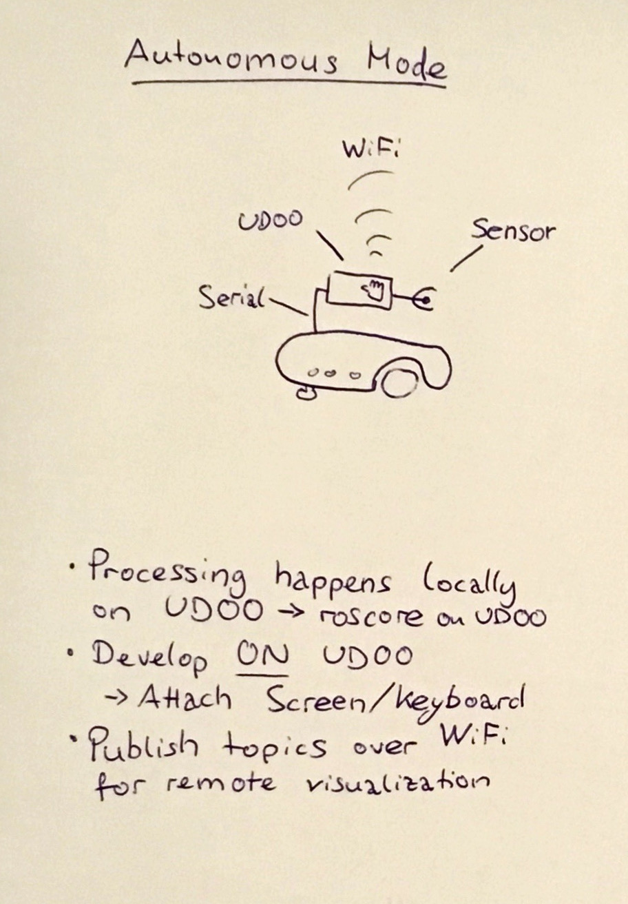
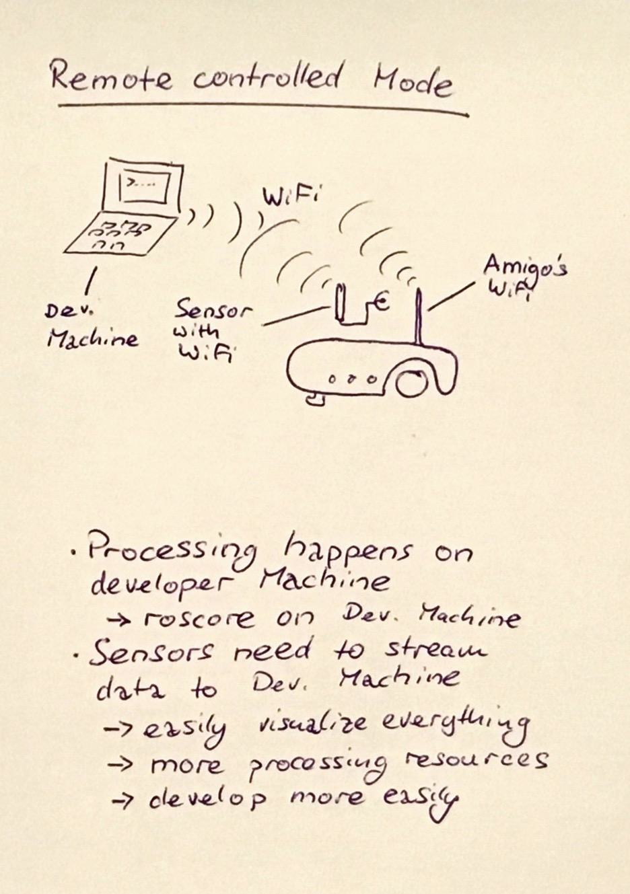
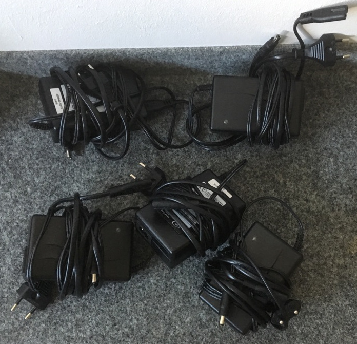

# Robot Amigobot

Amigobot is a proven-in-use sturdy robot.

See [the manual](https://www.generationrobots.com/media/AmigoGuide.pdf).

# Use Scenarios

## Autonomous Mode

## Remote Controlled Mode

# Use with ros

The package
[`amigobot`](../src/amigobot)
contains configurations and launch files to get the amigobot running and read out the sensor data.

## Bringup

If you use the **autonomous mode** you can run

    roslaunch amigobot autonomous_mode_bringup.launch

and if necessary set the correct device location for the usb serial via (this
might happen if you, for example, have both a lidar and the amigobot attached
to the same UDOO/RPi)

    roslaunch amigobot autonomous_mode_bringup.launch robot_port:=/dev/ttyUSB1

For the **remote controlled mode**, i.e. the roscore is running on your developer machine, you can bring it up using

    roslaunch amigobot remote_controlled_mode_bringup.launch

It assumes IP addresses for camera and robot.
If these addresses are not correct, you can set them using e.g.

    roslaunch amigobot remote_controlled_mode_bringup.launch robot_port:=192.168.0.17

## Model

The package also contains an
[URDF model](http://wiki.ros.org/urdf/Tutorials)
(written in
[xacro](http://wiki.ros.org/urdf/Tutorials/Using%20Xacro%20to%20Clean%20Up%20a%20URDF%20File))
for the robot that allows to publish the coordinate systems for different sensors:
[`amigobot.urdf.xacro`](../src/amigobot/urdf/amigobot.urdf.xacro)

If you attach sensors to the robot, make sure to include the position of those
in the model (or rather in you model based on this model).
In the model you can find a verbose description of how the camera tf was
created -- you can use this as a starting point.

## Advanced software stack

See the
[Software Catalogue](../software_catalogue/Readme.md)
for more info on software to run on the Amigobot.

# (Re)Charging

While the Amigobot is not driving around, attach it to a charger.

