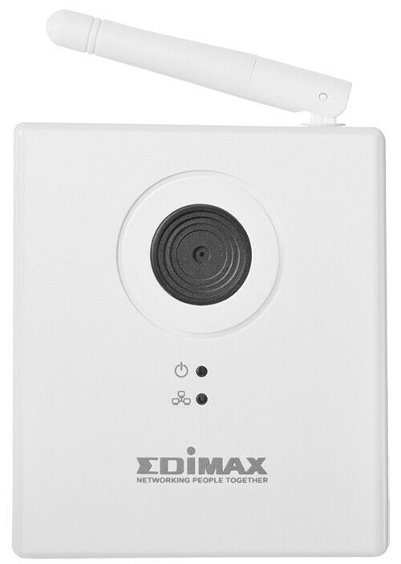

# Webcam Edimax IC-3115W.

# basics

We provide the webcam Edimax IC-3115W.
You can connect to them using either ethernet or WiFi.
They will use the same WiFi as the robots do.

# login

user name `admin`, password `1234`

# run with ros

In ros, use the provided package `web_cam_receiver`, which will publish the
image as `sensor_msgs/Image`.

See the [Readme](../src/web_cam_receiver/README.md) there.

# access image with other tools

To access the live image in a web browser, go to

    http://<IP adress of camera>/snapshot.cgi

A live image can be fetched using e.g. `wget` via

    wget --user=admin --password=1234 http://<IP addres of camera>/snapshot.jpg

for example

    wget --user=admin --password=1234 http://10.0.126.9/snapshot.jpg

# configure

To access the configuration, go to `http://<IP adress of camera>`.

# power

The web cam requires 5 VDC.

You can use the Amigobot's Aux Expansion J8 (remove the small black plastic
rectangle on top of the robot; J8 is the small 5 pin output): GND (-) is the
pin at the end towards the serial port, 5 VDC (+) is the pin on the other side.

See
[here](http://robots.mobilerobots.com/wiki/AmigoBot_Aux/User_Power_Supply)
for more info on the power supply options of the AmigoBot.
